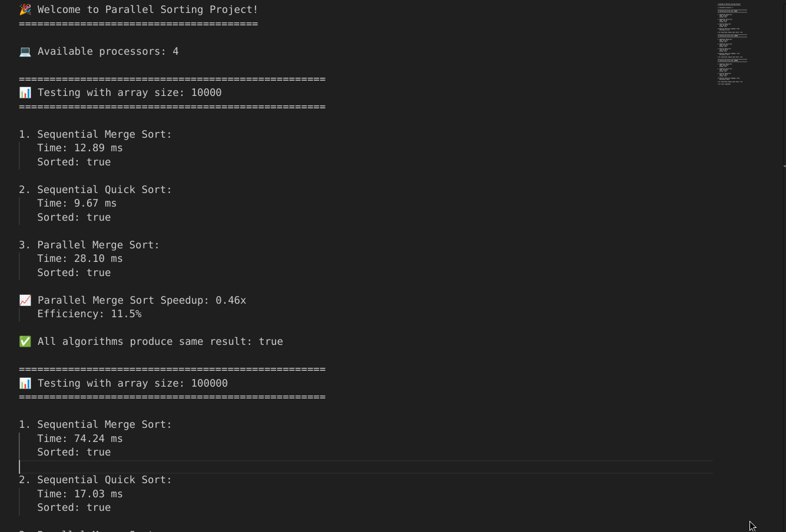
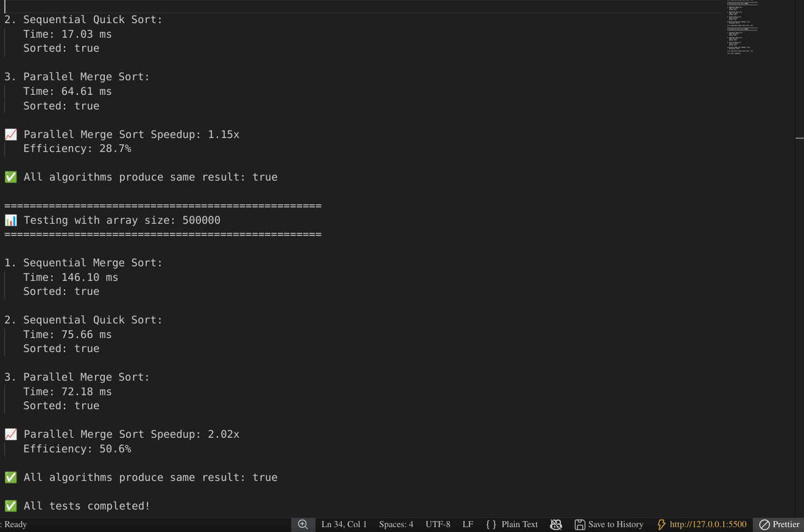
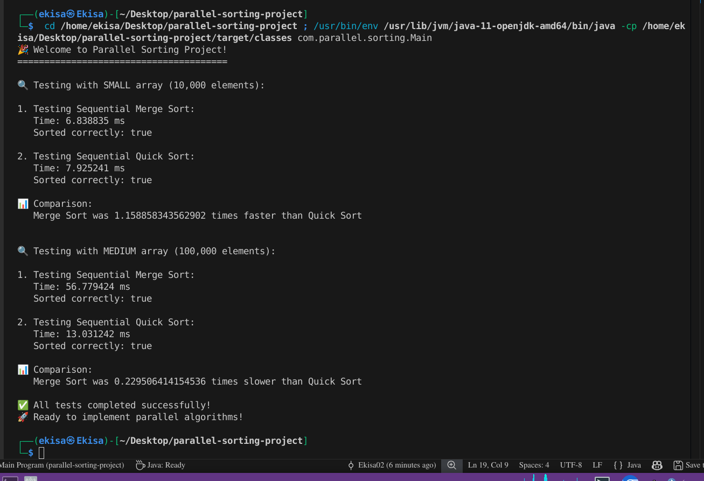

# Parallel Sorting Algorithms Project

**Course:** COMP 412 – Parallel and Distributed Systems  
**Institution:** University of Eldoret  
**Academic Year:** 2025/2026  
**Submission Date:** 8 January 2026  
**Version:** 3.0.0  
**Last Updated:** January 2025

---

## 📋 Table of Contents

- [Project Overview](#-project-overview)
- [Team Members](#-team-members)
- [Project Structure](#-project-structure)
- [Prerequisites](#-prerequisites)
- [Installation Guide](#-installation-guide)
- [Usage](#-usage)
- [Features](#-features)
- [Performance Metrics](#-performance-metrics)
- [Weekly Progress](#-weekly-progress)
- [Testing](#-testing)
- [Documentation](#-documentation)
- [Contributing](#-contributing)
- [License](#-license)
- [Acknowledgements](#-acknowledgements)
- [Project Status](#-project-status)

---

## 🚀 Project Overview

This project is an academic implementation and comparative study of sequential, parallel, and simulated distributed sorting algorithms using Java concurrency frameworks. The primary goal is to demonstrate and analyze the performance gains, limitations, and trade-offs of parallel and distributed computing approaches compared to traditional sequential methods.

### Key Objectives

1. Implement classical sequential sorting algorithms  
2. Design and implement parallel sorting techniques using Java concurrency  
3. Simulate distributed processing using a master–worker model  
4. Measure and analyze performance metrics such as speedup and efficiency  
5. Provide comprehensive documentation and performance reports  

### Technologies Used

- **Programming Language:** Java 11+  
- **Concurrency Frameworks:** ForkJoinPool, ExecutorService, Java Threads  
- **Build Tool:** Apache Maven  
- **IDE:** Visual Studio Code  
- **Version Control:** Git & GitHub  
- **Documentation:** Markdown, Javadoc, Google Docs  

---

## 👥 Team Members

| Name | Registration Number | Role |
|-----|--------------------|------|
| **Ekisa Joseph** | BIT/050/22 | Team Lead & Integration Specialist |
| Selina Mwao | BIT/054/22 | Algorithm Developer |
| Ekai Dickson | BIT/066/21 | Performance Analyst |
| Churchill Bosire | BIT/032/22 | Documentation Specialist |
| Cornelius Rotich | BIT/022/22 | Testing Engineer |
| Lewis Gitari | BIT/013/22 | Code Quality Manager |
| Faith Musyoka | BIT/010/22 | UI & Visualization Developer |
| Linet Kipsat | BIT/046/22 | Dataset Manager |
| Stephen Kinyamaria | BIT/012/22 | Deployment Specialist |
| Clinton Ondaba | BIT/074/22 | Fault Tolerance Engineer |

---

## 🏗️ Project Structure

```text
parallel-sorting-project/
├── .vscode/                  # VS Code configuration
├── src/
│   ├── main/java/com/parallel/sorting/
│   │   ├── algorithms/       # Sorting implementations
│   │   │   ├── sequential/
│   │   │   ├── parallel/
│   │   │   └── distributed/
│   │   ├── metrics/          # Performance measurement
│   │   ├── utils/            # Utility classes
│   │   ├── visualization/    # Charts and graphs
│   │   └── Main.java         # Application entry point
│   └── test/java/            # Test cases
├── data/                     # Generated datasets
├── docs/                     # Design and reports
├── results/                  # Benchmark outputs
├── pom.xml                   # Maven configuration
├── README.md                 # Project documentation
└── .gitignore

```

## Highlights

- Professional, reproducible experiments using Java 11+ and Maven.
- Multiple concurrency approaches: ForkJoinPool, ExecutorService, manual Threads.
- Master–worker simulation for distributed-style sorting and fault-tolerance experiments.
- Visualizations and charts for clear interpretation of empirical results.

---

## Demos & Diagrams

Below are representative demo images and diagrams generated by the project. These are stored in the repository under the `demo/` directory. Open them on GitHub or clone the repo to view them locally.

Parallel sorting demo (overview):



Parallel algorithm timeline / architecture diagram:



Sequential sorting demo:



For a complete set of demos and the highest-resolution images, see the `demo/` directory in this repository. If you intended a `demo/pngs/` subdirectory, note that the demo images in this repo live at `demo/*.png` — they are available and referenced above.

---

## Installation

Prerequisites:
- Java 11 or newer
- Apache Maven
- Git

Clone the repository and build with Maven:

```bash
git clone https://github.com/Ekisa02/parallel-sorting-project.git
cd parallel-sorting-project
mvn clean package
```

---

## Quick Start

Run the main application (example):

```bash
mvn exec:java -Dexec.mainClass="com.parallel.sorting.Main"
```

Run tests:

```bash
mvn test
```

Notes:
- Configuration options (dataset sizes, degree of parallelism, algorithm selection) are controlled via the project's configuration files or command-line arguments. See the `src/main/resources` or the code's `Main` entry point for precise flags.

---

## Usage Examples

1. Compare sequential vs parallel sorts on a dataset of 10 million integers and record runtime and memory usage.
2. Execute the master–worker simulation to observe simulated network partition handling and task redistribution.
3. Generate charts and visualizations by running the included visualization utilities; output is placed under `results/`.

---

## Performance & Results

Key performance metrics collected by the project include:
- Execution time (wall-clock)
- Speedup and efficiency relative to the sequential baseline
- CPU utilization and thread scalability

Representative charts and CSV outputs are available under `results/` and in `docs/` where full analysis and interpretation are provided.

---

## Development Notes

- Coding standards: follow the repository's style and use the provided `formatter` and `checkstyle` rules if present.
- Tests: Unit tests are provided under `src/test/java` — add more tests for new algorithms and edge cases.
- Visualizations: The `visualization` package includes chart generation code; outputs are PNGs stored in `demo/` and CSVs in `results/`.

---

## Contributing

Thank you for your interest in contributing. Please open issues for bugs or feature requests and submit pull requests for proposed changes. Ensure all new code is covered by tests and follows repository conventions.

---

## License

This project uses the MIT License. See the `LICENSE` file for details.

---

## Reference Document

A living project document and report is available at the Google Docs link:
https://docs.google.com/document/d/1rjHYDmjG38wYOcZP5O5KuICpEM6uslXQmfoXI5lqZbQ/edit?usp=sharing

---

